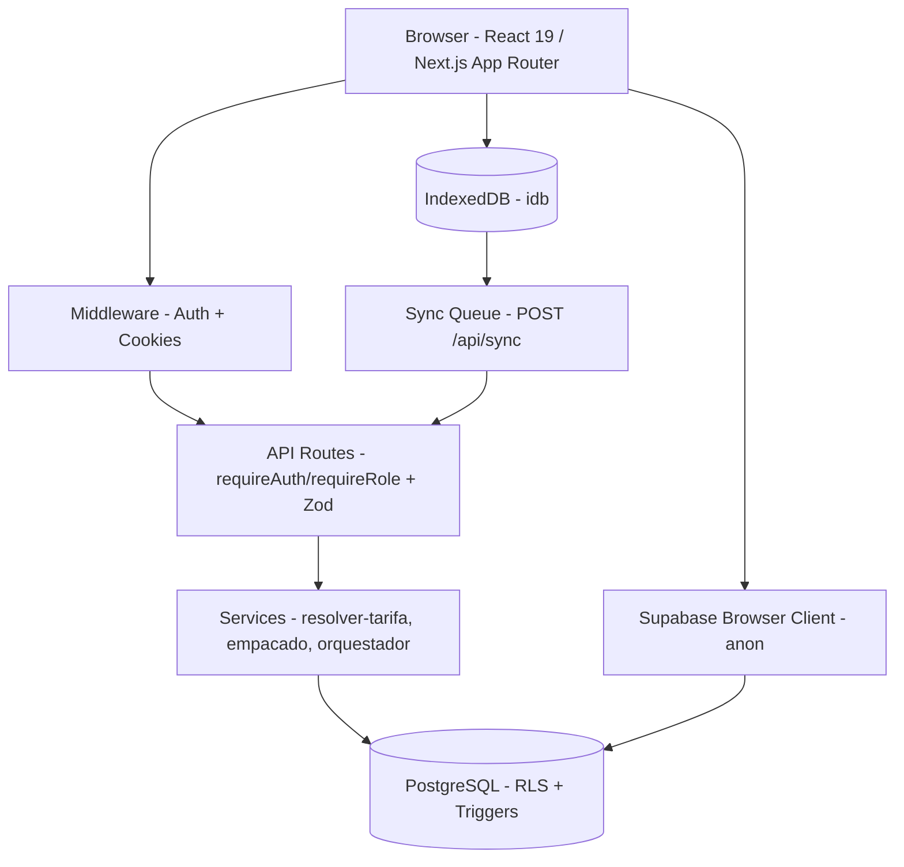

# ARCHITECTURE — Arquitectura del Sistema

> **Permalink base:** [`80b1dd5`](https://github.com/Brandoncm21/cac-desamparados-roast-manager/tree/80b1dd5)

## 1. Diagrama de Alto Nivel




Fuente editable: [`docs/diagrams/system_arch.mmd`](./diagrams/system_arch.mmd) — diagrama Mermaid renderizable en GitHub.

## 2. Componentes Principales

| Componente | Ubicación | Responsabilidad | Evidencia |
|------------|-----------|-----------------|-----------|
| **Client (Browser)** | `app/(dashboard)/**`, `components/**` | Renderizado React 19, formularios con RHF+Zod, gráficos `recharts` (code-split), PDF `jspdf`/`html-to-image` bajo demanda | [`app/layout.tsx:50-72`](https://github.com/Brandoncm21/cac-desamparados-roast-manager/blob/80b1dd5/app/layout.tsx#L50-L72), [`app/(dashboard)/tueste/[perfilId]/hooks/usePDF.ts:47`](https://github.com/Brandoncm21/cac-desamparados-roast-manager/blob/80b1dd5/app/(dashboard)/tueste/[perfilId]/hooks/usePDF.ts#L47) |
| **Middleware** | [`middleware.ts`](https://github.com/Brandoncm21/cac-desamparados-roast-manager/blob/80b1dd5/middleware.ts) | `createServerClient` con `applySecureCookies`; `getUser()` server-side; redirección `!auth → /login` y `auth + /login → /`; headers `Cache-Control: private, no-store` | [`middleware.ts:8-48`](https://github.com/Brandoncm21/cac-desamparados-roast-manager/blob/80b1dd5/middleware.ts#L8-L48) |
| **API Routes** | `app/api/**` (28 handlers) | `withErrorHandler`, `requireAuth`/`requireRole`, validación Zod, `createClient` o `createAdminClientWithRoleCheck` | [`lib/api-helpers.ts:57-87`](https://github.com/Brandoncm21/cac-desamparados-roast-manager/blob/80b1dd5/lib/api-helpers.ts#L57-L87) |
| **Services** | `lib/services/**` | Lógica de dominio pura: `resolverTarifaPorPeso` (intervalo `[min,max)`), `calcularEmpaques` (normalización gramos→kg), `orquestador` (orden estable por `prioridad, id`) | [`lib/services/resolver-tarifa.ts:9-20`](https://github.com/Brandoncm21/cac-desamparados-roast-manager/blob/80b1dd5/lib/services/resolver-tarifa.ts#L9-L20), [`lib/services/orquestador.ts:21-25`](https://github.com/Brandoncm21/cac-desamparados-roast-manager/blob/80b1dd5/lib/services/orquestador.ts#L21-L25) |
| **Schemas** | `lib/schemas/**` | Contratos Zod: `crearOrdenSchema`, `crearServicioSchema` (intervalos + anti-solape), `bulkTemperaturasSchema` | [`lib/schemas/servicios-maestro.ts:12-64`](https://github.com/Brandoncm21/cac-desamparados-roast-manager/blob/80b1dd5/lib/schemas/servicios-maestro.ts#L12-L64) |
| **Supabase** | `lib/supabase/**`, `supabase/**` | `client.ts` (browser anon), `server.ts` (SSR anon+cookies), `service-role.ts` (`server-only`, service_role), `admin.ts` (`requireRole` + service_role) | [`lib/supabase/service-role.ts:1-15`](https://github.com/Brandoncm21/cac-desamparados-roast-manager/blob/80b1dd5/lib/supabase/service-role.ts#L1-L15) |
| **Offline** | `lib/offline/**` | IndexedDB (`idb`) para cola de temperaturas/hitos/métricas; `POST /api/sync` con `upsert` | [`lib/offline/db.ts`](https://github.com/Brandoncm21/cac-desamparados-roast-manager/blob/80b1dd5/lib/offline/db.ts), [`lib/offline/sync.ts:6-44`](https://github.com/Brandoncm21/cac-desamparados-roast-manager/blob/80b1dd5/lib/offline/sync.ts#L6-L44) |
| **Seguridad** | `lib/cookies.ts`, `lib/env-*.ts`, `scripts/check-secrets.mjs` | `applySecureCookies` (preserva `httpOnly` de Supabase, `secure` en prod, `sameSite:lax`), `check-secrets` pre-build | [`lib/cookies.ts:24-70`](https://github.com/Brandoncm21/cac-desamparados-roast-manager/blob/80b1dd5/lib/cookies.ts#L24-L70) |

## 3. Flujo de Datos

### 3.1 Request Típico (Página Protegida)
```text
1. Browser → GET /ordenes
2. Middleware: createServerClient(getAll/setAll → applySecureCookies)
   → supabase.auth.getUser() [verifica JWT contra Auth server]
   → si !user && !isPublicRoute → 307 /login
   → si user && /login → 307 /
   → set Cache-Control: private, no-store
3. Route Handler (ej. GET /api/ordenes): requireRole(['Admin','Recepción','Tostador']) → supabase.from('ordenes_trabajo').select() [RLS: TO authenticated USING (deleted_at IS NULL)]
4. Services (si aplica): resolverTarifaPorPeso() / calcularEmpaques() / ordenarPorPrioridadEstable()
5. Response JSON → Browser render
```

Evidencia del flujo: [`middleware.ts:8-40`](https://github.com/Brandoncm21/cac-desamparados-roast-manager/blob/80b1dd5/middleware.ts#L8-L40) + [`lib/api-helpers.ts:68-87`](https://github.com/Brandoncm21/cac-desamparados-roast-manager/blob/80b1dd5/lib/api-helpers.ts#L68-L87) + [`app/api/ordenes/route.ts`](https://github.com/Brandoncm21/cac-desamparados-roast-manager/blob/80b1dd5/app/api/ordenes/route.ts).

### 3.2 Flujo Offline
```text
Browser offline → lib/offline/db.ts (IndexedDB) encola {table, data, retries}
    ↓ (cuando vuelve online)
lib/offline/sync.ts → POST /api/sync {items: [{tempId, table, data}]}
    ↓
API valida con Zod → upsert con onConflict (id_perfil, minuto / tipo_hito)
    ↓
Respuesta {idMap} → removeFromSyncQueue / incrementSyncQueueRetry (máx 3)
```

## 4. Módulos y Clases Clave

### 4.1 Autenticación y Autorización
- **Roles:** `Admin | Tostador | Recepción | Operador` ([`lib/auth-helpers.ts:3`](https://github.com/Brandoncm21/cac-desamparados-roast-manager/blob/80b1dd5/lib/auth-helpers.ts#L3)).
- **Client:** `getCurrentUserRole()` — solo `use client` ([`lib/auth-helpers.ts:10-23`](https://github.com/Brandoncm21/cac-desamparados-roast-manager/blob/80b1dd5/lib/auth-helpers.ts#L10-L23)).
- **Server:** `requireAuth()` (401 si no hay user) y `requireRole(roles)` (403 si rol no permitido, valida `roles` no vacío) ([`lib/api-helpers.ts:57-87`](https://github.com/Brandoncm21/cac-desamparados-roast-manager/blob/80b1dd5/lib/api-helpers.ts#L57-L87)).
- **Admin:** `createAdminClientWithRoleCheck(roles)` — verifica rol y luego crea cliente con `service_role` que bypassa RLS ([`lib/supabase/admin.ts:19-23`](https://github.com/Brandoncm21/cac-desamparados-roast-manager/blob/80b1dd5/lib/supabase/admin.ts#L19-L23)).

### 4.2 Validación en Capas
| Capa | Mecanismo | Ejemplo |
|------|-----------|---------|
| Frontend | Zod en RHF (`@hookform/resolvers`) | `crearOrdenSchema` en [`app/(dashboard)/ordenes/nueva/page.tsx`](https://github.com/Brandoncm21/cac-desamparados-roast-manager/blob/80b1dd5/app/(dashboard)/ordenes/nueva/page.tsx) |
| API | `safeParse` + `apiValidationError` (422) | [`app/api/admin/servicios/route.ts:24-25`](https://github.com/Brandoncm21/cac-desamparados-roast-manager/blob/80b1dd5/app/api/admin/servicios/route.ts#L24-L25) |
| DB | Constraints + trigger anti-solape + RLS | [`supabase/migrations/0019_flujo_secuencial_tarifas_intervalo.sql:119-135`](https://github.com/Brandoncm21/cac-desamparados-roast-manager/blob/80b1dd5/supabase/migrations/0019_flujo_secuencial_tarifas_intervalo.sql#L119-L135) |

### 4.3 Manejo de Errores
`AppError` tipado con `code` y `status` ([`lib/error-handler.ts:1-60`](https://github.com/Brandoncm21/cac-desamparados-roast-manager/blob/80b1dd5/lib/error-handler.ts#L1-L60)), `handleApiError` centraliza 401/403/422/500, `withErrorHandler` envuelve handlers.

### 4.4 Hidratación y Cookies
- **Hidratación:** script inline en [`app/layout.tsx:50-72`](https://github.com/Brandoncm21/cac-desamparados-roast-manager/blob/80b1dd5/app/layout.tsx#L50-L72) elimina `bis_skin_checked` (extensión Bitdefender) con `MutationObserver({attributes:true, attributeFilter:["bis_skin_checked"]})`.
- **Cookies:** [`lib/cookies.ts`](https://github.com/Brandoncm21/cac-desamparados-roast-manager/blob/80b1dd5/lib/cookies.ts) preserva `httpOnly` del upstream (Supabase SSR requiere cookies legibles por JS para `createBrowserClient`).

## 5. Decisiones Arquitectónicas Relevantes

- **Service Role aislada:** [`lib/supabase/service-role.ts`](https://github.com/Brandoncm21/cac-desamparados-roast-manager/blob/80b1dd5/lib/supabase/service-role.ts) con `import "server-only"` — impide importación desde cliente (build falla).
- **Pesos en `NUMERIC(10,2)`:** nunca `FLOAT` para evitar errores de precisión monetaria ([`supabase/migrations/0017_servicios_maestro_empaques.sql`](https://github.com/Brandoncm21/cac-desamparados-roast-manager/blob/80b1dd5/supabase/migrations/0017_servicios_maestro_empaques.sql)).
- **Precios versionados:** `empaque_precios(valid_from, valid_to)` y `servicio_precios(activo)` preservan historial sin alterar órdenes existentes.
- **Code-splitting:** `recharts` y `jspdf`/`html-to-image` cargados con `next/dynamic` + `import()` dinámico ([`app/(dashboard)/tueste/[perfilId]/hooks/usePDF.ts:47`](https://github.com/Brandoncm21/cac-desamparados-roast-manager/blob/80b1dd5/app/(dashboard)/tueste/[perfilId]/hooks/usePDF.ts#L47)).
